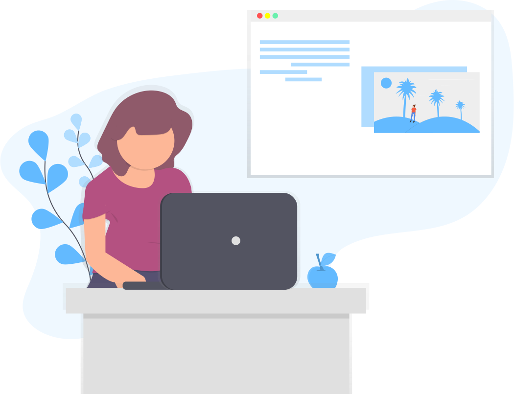

<div align="center">

## musings-sphere


[](https://circleci.com/gh/musings-sphere/musings-fe/tree/main)
[](https://codeclimate.com/github/musings-sphere/musings-fe/maintainability)
[](https://codeclimate.com/github/musings-sphere/musings-fe/test_coverage)
[](https://app.netlify.com/sites/naughty-tereshkova-0355f1/deploys)

</div>

<div align="center">

    Musings sphere to share amazing ideas and articles with the rest of the world.

[](https://almond-re-staging.herokuapp.com/)

#### Simple but complicated musings

</div>

## Description

This application will be used in a hydroponics farm control system to be used at home with limited space, in greenhouses and indoors as well.

This is a [Next.js](https://nextjs.org/) project bootstrapped with [`create-next-app`](https://github.com/vercel/next.js/tree/canary/packages/create-next-app).

### Development set up

1. Install [`Node JS`](https://nodejs.org/en/).
2. To clone, run `git clone https://github.com/mashafrancis/almond-re`.
3. `cd` into the root of the **project directory**.
4. Install [`yarn`](https://yarnpkg.com/en/docs/install#mac-stable).
5. Run `yarn install` on the terminal to install dependencies.
6. Create a `.env` file in the root directory of the application. Example of the content of a `.env` file is shown in the `.env.example`
7. Setup local development server.

- In your terminal, execute the following command:
  ```bash
    sudo nano /etc/hosts
  ```
  Otherwise, you can open your hosts file in your editor of choice.
- Add the following line to your `hosts` file:

  ```bash
    127.0.0.1 musings-sphere.com
  ```

- Save changes and quit the editor.

### Development server

Run `yarn start:dev` for a dev server. Navigate to `http://froyo.almond.com:3000/`. The app will automatically reload if you change any of the source files.

### Build

Run `yarn build` to build the project. The build artifacts will be stored in the `dist/` directory. Use the `--prod` flag for a production build.

## Running unit tests

Run `yarn test` to execute the unit tests. This is achieved through the use of jest package which is used to test javascript code .

## Running end-to-end tests

Run `yarn cypress:open` to execute the end-to-end tests via Cypress.

## Others
[API routes](https://nextjs.org/docs/api-routes/introduction) can be accessed on [http://localhost:3000/api/hello](http://localhost:3000/api/hello). This endpoint can be edited in `pages/api/hello.js`.

The `pages/api` directory is mapped to `/api/*`. Files in this directory are treated as [API routes](https://nextjs.org/docs/api-routes/introduction) instead of React pages.

## Learn More

To learn more about Next.js, take a look at the following resources:

- [Next.js Documentation](https://nextjs.org/docs) - learn about Next.js features and API.
- [Learn Next.js](https://nextjs.org/learn) - an interactive Next.js tutorial.

You can check out [the Next.js GitHub repository](https://github.com/vercel/next.js/) - your feedback and contributions are welcome!

## Deploy on Vercel

The easiest way to deploy your Next.js app is to use the [Vercel Platform](https://vercel.com/new?utm_medium=default-template&filter=next.js&utm_source=create-next-app&utm_campaign=create-next-app-readme) from the creators of Next.js.

Check out our [Next.js deployment documentation](https://nextjs.org/docs/deployment) for more details.
